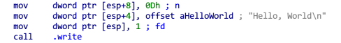

# Write-Up
```cpp
void vulnerable_function()  {
	char buf[128];
	read(STDIN_FILENO, buf,256);
}

void be_nice_to_people() {
	// /bin/sh is usually symlinked to bash, which usually drops privs. Make
	// sure we don't drop privs if we exec bash, (ie if we call system()).
	gid_t gid = getegid();
	setresgid(gid, gid, gid);
}

int main(int argc, char** argv) {
        be_nice_to_people();
	vulnerable_function();
	write(STDOUT_FILENO, "Hello, World\n", 13);
}
```
可以看到，程序中没有system函数，需要我们自己找

~~怎么这么快就要泄露libc了？~~

程序会调用libc来实现某些功能，如本程序中的```write```函数和```getegid```函数，还有好多函数，都需要动态链接运行的linux中的libc来实现

同时libc中也就有```system```函数和```/bin/sh```字符串，也有一些直接getshell的代码段(one_gadget)，都可以进行利用


由于libc是动态加载的，每次运行时加载到的基址是不同的
>libc函数地址 = libc基址 + 函数在libc中的偏移

所以我们得先泄露某些函数的地址，从而计算出基址，再利用偏移
>1.泄露函数地址  
>2.计算libc基址  
>3.定位到我们需要的地址，并利用

泄露的方法有很多，以后碰到题目再具体分析

本题可以利用```write```函数来打印出某个函数的地址

先看看```write```函数的定义
>ssize_t write(int fd, const void *buf, size_t nbyte);

再看看在汇编中```write```的使用



我们可以看到，这里是往栈中依次放入nbyte,buf,fd三个值
>nbyte:字符串长度  
>buf:待处理字符串  
>fd:Linux标准文件描述符

|文件描述符|缩写|描述|
|----|----:|:--:|
|0|STDIN|标准输入|
|1|STDOUT|标准输出|
|2|STDERR|标准错误输出|

这里是利用了fd=1，也就标准输出，往输出流写数据，显示给我们看

第二个参数是放的字符串指针，函数会把这个指针指向的数据输出

第三个参数就是输出的长度

而如果有某个指针可以指向某个函数的地址，那么就可以作为第二个参数，来执行此函数，然后就可以把这个指针指向的函数地址打印出来，我们就知道这个函数的地址在哪里啦

那么这个指针是什么？什么东西会存放着指向函数的指针

那就是GOT表，与之相关的还有一个PLT表，详细的先不说

GOT表中会存放着每个函数对应的libc地址

因此我们通过泄露GOT表即可得到这个函数的地址从而计算出libc的加载基址

但是由于Linux的延迟绑定技术，某个函数得使用过后GOT表中才会记录有数据，所以我们只能来泄露已经运行过的函数